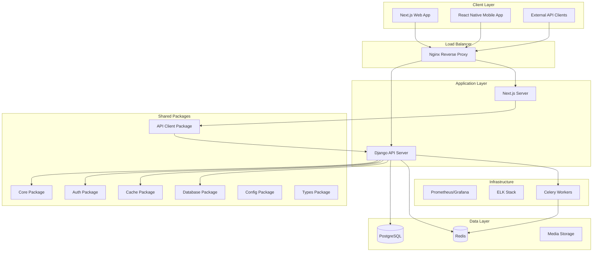

# Design Document

## Overview

This design document outlines the architecture for transforming the existing Django Personal Blog API into a comprehensive enterprise-grade fullstack monolithic system. The design follows domain-driven principles with clear separation of concerns, shared packages for reusability, and tight integration between Django backend and Next.js frontend applications.

The architecture is designed to provide the benefits of a monolith (shared database, transactions, simple deployment) while maintaining the structure needed to scale to microservices when necessary.

## Architecture

### High-Level Architecture



### Package-First Architecture

The system uses installable packages as the foundation for shared functionality:

1. **packages/core/**: Core business logic, utilities, exceptions, validators
2. **packages/auth/**: Authentication strategies, security utilities, JWT handling
3. **packages/cache/**: Caching providers, strategies, decorators
4. **packages/database/**: Connection management, repositories, migrations
5. **packages/config/**: Environment management, feature flags
6. **packages/types/**: Shared TypeScript and Python type definitions
7. **packages/api-client/**: TypeScript client for Django API communication

## Components and Interfaces

### Django API Layer (apps/api/)

#### Core Django Apps Structure

```
apps/api/
├── config/                    # Django project configuration
│   ├── settings/             # Environment-specific settings
│   ├── urls.py              # Root URL configuration
│   ├── wsgi.py              # WSGI application
│   └── asgi.py              # ASGI application for WebSockets
├── apps/                     # Django applications
│   ├── accounts/            # User management domain
│   ├── blog/                # Blog functionality domain
│   ├── comments/            # Comments system domain
│   ├── analytics/           # Analytics tracking domain
│   ├── newsletter/          # Newsletter system domain
│   └── api/                 # API endpoints and versioning
└── static/                  # Static files
```

#### API Versioning Strategy

- RESTful API with version namespacing (`/api/v1/`, `/api/v2/`)
- Backward compatibility maintained for at least 2 versions
- GraphQL endpoint for complex queries (`/graphql/`)
- WebSocket endpoints for real-time features (`/ws/`)

#### Authentication & Authorization

- JWT token-based authentication with refresh tokens
- Role-based access control (RBAC) with custom permissions
- Multi-factor authentication (MFA) support
- OAuth2 integration for social login
- Session-based authentication for web interface

### Next.js Web Application (apps/web/)

#### Application Structure

```
apps/web/
├── src/
│   ├── app/                 # Next.js App Router
│   │   ├── (auth)/         # Authentication route group
│   │   ├── (dashboard)/    # Dashboard route group
│   │   ├── api/           # API routes for SSR
│   │   └── globals.css    # Global styles
│   ├── components/         # React components
│   │   ├── ui/            # Base UI components
│   │   ├── forms/         # Form components
│   │   ├── layout/        # Layout components
│   │   └── features/      # Feature-specific components
│   ├── hooks/             # Custom React hooks
│   ├── providers/         # Context providers
│   ├── services/          # API services
│   ├── store/             # State management
│   └── utils/             # Utility functions
└── public/                # Static assets
```

#### State Management Strategy

- **Zustand** for client-side state management
- **React Query** for server state and caching
- **Context API** for theme and authentication state
- **Local Storage** for user preferences and offline data

#### Rendering Strategy

- **Server-Side Rendering (SSR)** for SEO-critical pages
- **Static Site Generation (SSG)** for blog posts and static content
- **Client-Side Rendering (CSR)** for interactive dashboard components
- **Incremental Static Regeneration (ISR)** for frequently updated content

### Communication Layer

#### API Client Package (packages/api-client/)

```typescript
// Centralized API client with interceptors
class APIClient {
  private axios: AxiosInstance;

  constructor() {
    this.axios = axios.create({
      baseURL: process.env.NEXT_PUBLIC_API_URL,
      timeout: 10000,
    });

    this.setupInterceptors();
  }

  private setupInterceptors() {
    // Request interceptor for auth tokens
    this.axios.interceptors.request.use(this.addAuthToken);

    // Response interceptor for token refresh
    this.axios.interceptors.response.use(this.handleSuccess, this.handleError);
  }
}
```

#### Real-time Communication

- **Django Channels** for WebSocket handling
- **Redis** as message broker for WebSocket scaling
- **JWT authentication** for WebSocket connections
- **Automatic reconnection** with exponential backoff
- **Message queuing** for offline message delivery

### Shared Packages Design

#### Core Package (packages/core/)

```python
# Enterprise-grade utilities and patterns
from enterprise_core.exceptions import BusinessLogicError
from enterprise_core.validators import validate_email_domain
from enterprise_core.utils import generate_slug_with_validation
from enterprise_core.patterns import Repository, UnitOfWork
from enterprise_core.decorators import cache_result, rate_limit
```

#### Authentication Package (packages/auth/)

```python
# Comprehensive authentication strategies
from auth_package.strategies import JWTStrategy, OAuth2Strategy
from auth_package.mfa import TOTPProvider, SMSProvider
from auth_package.security import PasswordHasher, TokenManager
from auth_package.permissions import RoleBasedPermission
```

#### Cache Package (packages/cache/)

```python
# Multi-level caching strategies
from cache_package.providers import RedisProvider, MemoryProvider
from cache_package.strategies import CacheAside, WriteThrough
from cache_package.decorators import cacheable, cache_evict
from cache_package.invalidation import TagBasedInvalidation
```

## Data Models

### Database Schema Design

#### User Management

```python
# Shared user types across packages
from packages.types.python.user_types import UserRole, UserStatus

class User(AbstractUser):
    email = models.EmailField(unique=True)
    role = models.CharField(max_length=20, choices=UserRole.choices)
    status = models.CharField(max_length=20, choices=UserStatus.choices)
    created_at = models.DateTimeField(auto_now_add=True)
    updated_at = models.DateTimeField(auto_now=True)

class Profile(models.Model):
    user = models.OneToOneField(User, on_delete=models.CASCADE)
    avatar = VersatileImageField(upload_to='avatars/')
    bio = models.TextField(blank=True)
    social_links = models.JSONField(default=dict)
```

#### Blog System

```python
class Category(models.Model):
    name = models.CharField(max_length=100, unique=True)
    slug = models.SlugField(unique=True)
    description = models.TextField(blank=True)

class Tag(models.Model):
    name = models.CharField(max_length=50, unique=True)
    slug = models.SlugField(unique=True)

class Post(models.Model):
    title = models.CharField(max_length=200)
    slug = models.SlugField(unique=True)
    content = RichTextField()
    author = models.ForeignKey(User, on_delete=models.CASCADE)
    category = models.ForeignKey(Category, on_delete=models.SET_NULL, null=True)
    tags = models.ManyToManyField(Tag, blank=True)
    status = models.CharField(max_length=20, choices=PostStatus.choices)
    published_at = models.DateTimeField(null=True, blank=True)
    created_at = models.DateTimeField(auto_now_add=True)
    updated_at = models.DateTimeField(auto_now=True)
```

#### Analytics System

```python
class PageView(models.Model):
    url = models.URLField()
    user = models.ForeignKey(User, null=True, blank=True, on_delete=models.SET_NULL)
    ip_address = models.GenericIPAddressField()
    user_agent = models.TextField()
    referrer = models.URLField(blank=True)
    timestamp = models.DateTimeField(auto_now_add=True)

class SearchQuery(models.Model):
    query = models.CharField(max_length=255)
    user = models.ForeignKey(User, null=True, blank=True, on_delete=models.SET_NULL)
    results_count = models.IntegerField()
    timestamp = models.DateTimeField(auto_now_add=True)
```

### Type Safety Implementation

#### Shared Type Definitions

```typescript
// packages/types/typescript/api.ts
export interface APIResponse<T> {
  success: boolean;
  data: T;
  message: string;
  errors?: Record<string, string[]>;
}

export interface PaginatedResponse<T> extends APIResponse<T[]> {
  pagination: {
    page: number;
    pages: number;
    per_page: number;
    total: number;
  };
}

// Generated from Django models
export interface User {
  id: number;
  username: string;
  email: string;
  role: UserRole;
  profile: Profile;
  created_at: string;
}
```

## Error Handling

### Centralized Error Management

#### Backend Error Handling

```python
# packages/core/exceptions/base.py
class BusinessLogicError(Exception):
    """Base exception for business logic errors"""
    def __init__(self, message: str, code: str = None, details: dict = None):
        self.message = message
        self.code = code or self.__class__.__name__
        self.details = details or {}
        super().__init__(self.message)

class ValidationError(BusinessLogicError):
    """Validation-specific errors"""
    pass

class AuthenticationError(BusinessLogicError):
    """Authentication-specific errors"""
    pass
```

#### Frontend Error Handling

```typescript
// Error boundary for React components
class ErrorBoundary extends React.Component {
  constructor(props) {
    super(props);
    this.state = { hasError: false, error: null };
  }

  static getDerivedStateFromError(error) {
    return { hasError: true, error };
  }

  componentDidCatch(error, errorInfo) {
    // Log error to monitoring service
    this.logErrorToService(error, errorInfo);
  }
}

// Global error handler for API calls
const handleAPIError = (error: AxiosError) => {
  if (error.response?.status === 401) {
    // Handle authentication errors
    redirectToLogin();
  } else if (error.response?.status >= 500) {
    // Handle server errors
    showErrorNotification("Server error occurred");
  }
};
```

### Error Monitoring and Alerting

- **Sentry** integration for error tracking and alerting
- **Custom error logging** with structured data
- **Error rate monitoring** with automatic alerts
- **User-friendly error messages** with actionable guidance

## Testing Strategy

### Multi-Level Testing Approach

#### Unit Testing

- **Django**: pytest with factory_boy for model testing
- **Next.js**: Jest with React Testing Library for component testing
- **Packages**: Isolated testing for each shared package
- **Coverage**: Minimum 80% code coverage requirement

#### Integration Testing

- **API Integration**: Test Django API endpoints with real database
- **Frontend Integration**: Test Next.js pages with mocked API responses
- **Package Integration**: Test package interactions and dependencies
- **Database Integration**: Test repository patterns and data access

#### End-to-End Testing

- **Playwright**: Cross-browser E2E testing for critical user flows
- **API Testing**: Postman/Newman for API workflow testing
- **Performance Testing**: Load testing with Artillery or k6
- **Security Testing**: OWASP ZAP for security vulnerability scanning

#### Testing Infrastructure

```yaml
# GitHub Actions workflow for testing
name: Test Suite
on: [push, pull_request]
jobs:
  test-backend:
    runs-on: ubuntu-latest
    services:
      postgres:
        image: postgres:15
      redis:
        image: redis:7
    steps:
      - uses: actions/checkout@v3
      - name: Run Django tests
        run: |
          cd apps/api
          python -m pytest --cov=. --cov-report=xml

  test-frontend:
    runs-on: ubuntu-latest
    steps:
      - uses: actions/checkout@v3
      - name: Run Next.js tests
        run: |
          cd apps/web
          npm test -- --coverage --watchAll=false

  test-e2e:
    runs-on: ubuntu-latest
    steps:
      - uses: actions/checkout@v3
      - name: Run E2E tests
        run: |
          docker-compose up -d
          npx playwright test
```

This design provides a comprehensive foundation for the fullstack monolithic architecture transformation. The next step will be creating the detailed implementation tasks.

### Performance Optimization Strategy

#### Caching Layers

1. **Browser Cache**: Static assets with long-term caching headers
2. **CDN Cache**: Global content delivery for static files and images
3. **Application Cache**: Redis-based caching for API responses and sessions
4. **Database Cache**: Query result caching and connection pooling
5. **Template Cache**: Django template fragment caching

#### Database Optimization

- **Connection Pooling**: pgbouncer for PostgreSQL connection management
- **Read Replicas**: Separate read/write database connections
- **Query Optimization**: Database query monitoring and index optimization
- **Bulk Operations**: Efficient bulk insert/update operations
- **Lazy Loading**: Optimized ORM queries with select_related and prefetch_related

#### Frontend Optimization

- **Code Splitting**: Dynamic imports for route-based code splitting
- **Image Optimization**: Next.js Image component with WebP support
- **Bundle Analysis**: Webpack bundle analyzer for optimization
- **Tree Shaking**: Elimination of unused code
- **Compression**: Gzip/Brotli compression for assets

### Security Architecture

#### Authentication Security

```python
# JWT token configuration
JWT_SETTINGS = {
    'ACCESS_TOKEN_LIFETIME': timedelta(minutes=15),
    'REFRESH_TOKEN_LIFETIME': timedelta(days=7),
    'ROTATE_REFRESH_TOKENS': True,
    'BLACKLIST_AFTER_ROTATION': True,
    'ALGORITHM': 'RS256',  # RSA256 for better security
    'SIGNING_KEY': settings.JWT_PRIVATE_KEY,
    'VERIFYING_KEY': settings.JWT_PUBLIC_KEY,
}
```

#### API Security

- **Rate Limiting**: Configurable rate limits per endpoint and user type
- **Input Validation**: Comprehensive input sanitization and validation
- **CORS Configuration**: Strict CORS policy for cross-origin requests
- **CSRF Protection**: Enhanced CSRF protection with token rotation
- **SQL Injection Prevention**: Parameterized queries and ORM usage
- **XSS Protection**: Content Security Policy and input escaping

#### Infrastructure Security

- **HTTPS Enforcement**: TLS 1.3 with HSTS headers
- **Security Headers**: Comprehensive security headers implementation
- **Secrets Management**: Environment-based secret management
- **Container Security**: Minimal Docker images with security scanning
- **Network Security**: VPC configuration with private subnets

### Monitoring and Observability

#### Application Metrics

```python
# Custom metrics collection
from prometheus_client import Counter, Histogram, Gauge

# API request metrics
api_requests_total = Counter(
    'api_requests_total',
    'Total API requests',
    ['method', 'endpoint', 'status']
)

# Response time metrics
api_request_duration = Histogram(
    'api_request_duration_seconds',
    'API request duration',
    ['method', 'endpoint']
)

# Active user metrics
active_users = Gauge(
    'active_users_total',
    'Number of active users'
)
```

#### Logging Strategy

- **Structured Logging**: JSON-formatted logs with correlation IDs
- **Log Levels**: Appropriate log levels for different environments
- **Log Aggregation**: Centralized logging with ELK stack or Loki
- **Log Retention**: Configurable log retention policies
- **Security Logging**: Audit trail for security-related events

#### Health Checks

```python
# Comprehensive health check endpoint
class HealthCheckView(APIView):
    def get(self, request):
        checks = {
            'database': self.check_database(),
            'redis': self.check_redis(),
            'celery': self.check_celery(),
            'external_apis': self.check_external_apis(),
        }

        status = 'healthy' if all(checks.values()) else 'unhealthy'
        return Response({
            'status': status,
            'checks': checks,
            'timestamp': timezone.now().isoformat()
        })
```

### Deployment Architecture

#### Container Strategy

```dockerfile
# Multi-stage Django Dockerfile
FROM python:3.11-slim as base
WORKDIR /app
COPY requirements/ requirements/
RUN pip install --no-cache-dir -r requirements/production.txt

FROM base as production
COPY . .
RUN python manage.py collectstatic --noinput
EXPOSE 8000
CMD ["gunicorn", "config.wsgi:application", "--bind", "0.0.0.0:8000"]
```

#### Kubernetes Deployment

```yaml
# Django API deployment
apiVersion: apps/v1
kind: Deployment
metadata:
  name: django-api
spec:
  replicas: 3
  selector:
    matchLabels:
      app: django-api
  template:
    metadata:
      labels:
        app: django-api
    spec:
      containers:
        - name: django-api
          image: django-api:latest
          ports:
            - containerPort: 8000
          env:
            - name: DATABASE_URL
              valueFrom:
                secretKeyRef:
                  name: database-secret
                  key: url
          resources:
            requests:
              memory: "256Mi"
              cpu: "250m"
            limits:
              memory: "512Mi"
              cpu: "500m"
```

#### CI/CD Pipeline

```yaml
# Complete CI/CD workflow
name: Deploy to Production
on:
  push:
    branches: [main]
jobs:
  test:
    runs-on: ubuntu-latest
    steps:
      - uses: actions/checkout@v3
      - name: Run tests
        run: make test

  build:
    needs: test
    runs-on: ubuntu-latest
    steps:
      - uses: actions/checkout@v3
      - name: Build Docker images
        run: |
          docker build -t django-api:${{ github.sha }} apps/api/
          docker build -t nextjs-web:${{ github.sha }} apps/web/
      - name: Push to registry
        run: |
          docker push django-api:${{ github.sha }}
          docker push nextjs-web:${{ github.sha }}

  deploy:
    needs: build
    runs-on: ubuntu-latest
    steps:
      - name: Deploy to Kubernetes
        run: |
          kubectl set image deployment/django-api django-api=django-api:${{ github.sha }}
          kubectl set image deployment/nextjs-web nextjs-web=nextjs-web:${{ github.sha }}
          kubectl rollout status deployment/django-api
          kubectl rollout status deployment/nextjs-web
```

### Scalability Considerations

#### Horizontal Scaling

- **Stateless Services**: All services designed to be stateless for easy scaling
- **Load Balancing**: Nginx load balancer with health checks
- **Auto Scaling**: Kubernetes HPA based on CPU and memory metrics
- **Database Scaling**: Read replicas and connection pooling
- **Cache Scaling**: Redis cluster for distributed caching

#### Vertical Scaling

- **Resource Optimization**: Efficient resource utilization monitoring
- **Performance Profiling**: Regular performance profiling and optimization
- **Memory Management**: Proper memory management and garbage collection
- **CPU Optimization**: CPU-intensive task optimization

This comprehensive design document provides the foundation for implementing the enterprise-grade fullstack monolithic architecture. The design emphasizes scalability, maintainability, security, and performance while maintaining the benefits of a monolithic deployment model.
